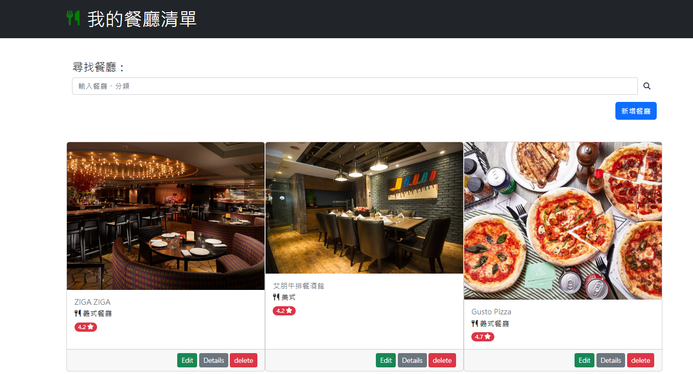
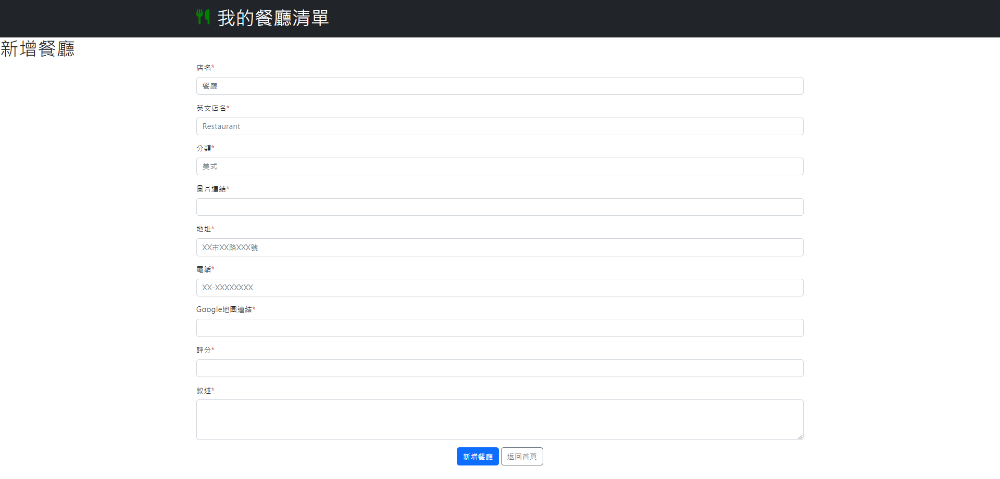
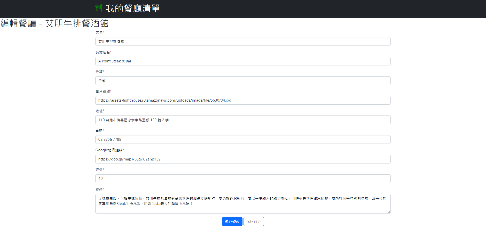

# 我的餐廳清單



## 介紹

蒐集自己屬意的餐廳清單，可以瀏覽餐廳、查看詳細資訊、查詢評分及地址。

### 功能

- 查看所有餐廳

- 瀏覽餐廳的詳細資訊

- 連結餐廳的地址到 Google 地圖
- 搜尋特定餐廳
- 新增餐廳

- 編輯餐廳

- 刪除餐廳

## 開始使用

1. 請先確認有安裝 node.js 與 npm
2. 將專案 clone 到本地
3. 在本地開啟之後，透過終端機進入資料夾，輸入：

   ```bash
   npm install // 安裝套件
   ```

4. 設定 MongoDB 環境變數

   ```
   set MONGODB_URI="你的MongoDB連線字串" // for Windows cmd
   export MONGODB_URI="你的MongoDB連線字串" // for bash (MacOS bash terminal and Git bash for Windows)
   ```

5. 寫入種子資料

   ```bash
   npm run seed
   ```

6. 開啟程式

   ```bash
   npm run start
   ```

7. 若看見此行訊息則代表順利運行，打開瀏覽器進入到以下網址

   ```bash
   Restaurant List is now listening on http://localhost:3000
   ```

   請至 http://localhost:3000 開啟網站

8. 若欲中斷伺服器連線，請按

   ```bash
   ctrl + c
   ```


## 開發工具

- Node.js 14.16.0
- Express 4.16.4
- Express-Handlebars 3.0.0
- MongoDB
- mongoose 6.0.5
- method-override 3.0.0

